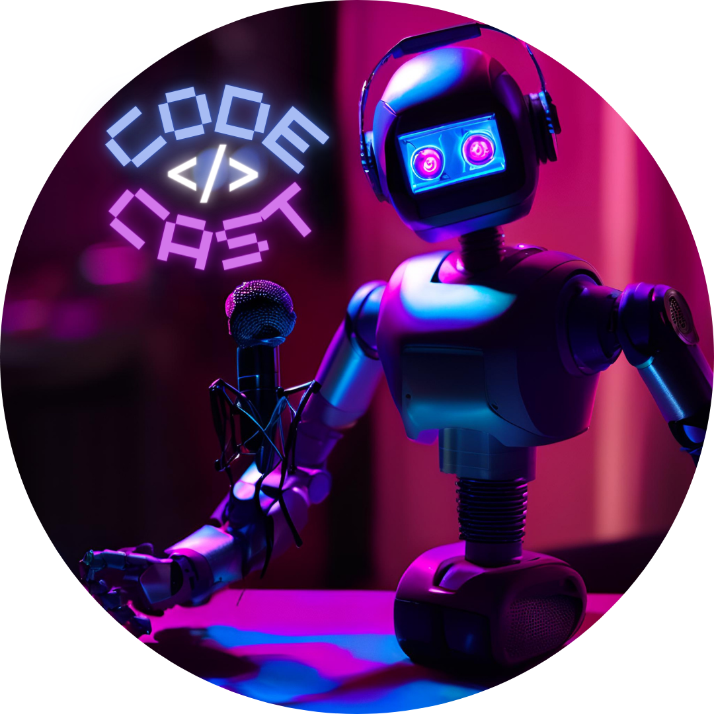

# Projeto Podcast Gerado por I.A.s

Projeto com o objetivo de gerar um podcast utilizando ferramentas de IA através de prompts mais trabalhado. Solicitado no bootcamp "Santander 2024-Fundamentos de IA para Devs" na plataforma da [DIO](https://dio.me).

- Podcast localizado em "output/podcast_codecast_editado.MP3"

    <audio src="output/podcast_codecast_editado.MP3" controls title="Podcast editado"></audio>

## 💻 Tecnologias utilizadas no projeto

- [ChatGPT](https://chat.openai.com/) 
- [Canva](https://www.canva.com)
- [ElevenLabs](https://beta.elevenlabs.io/)
- [Capcut](https://www.capcut.com/pt-br/)

## ✨ Como foi feito ?

- Roteiro gerado via chatgpt
- Audio gerado pela ElevenLabs
- Canva para gerar a capa
- Capcut para tratar o aúdio e adicionar sons de fundo

## 🧠 Prompts

ChatGPT：

|   Ação   | prompt                                                                                                                                                                                                                                                                         |
| :------: | ------------------------------------------------------------------------------------------------------------------------------------------------------------------------------------------------------------------------------------------------------------------------------ |
|  título  | Você é um roteirista de podcast, e vamos criar um podcast de tecnologia, focado em front end e eu gostaria de uma ajuda sua para criar 5 sugestões de nomes criativos para um podcast de front end feito por nerds, e que tenha algum trocadilho nerd no nome. O podcast vai falar sobre dicas e novidades sobre o mundo do front end e o que está acontecendo no mercado {REGRAS} -O nome deve ser enxuto, um nome e um subtítulo -O nome tenha algum trocadilho nerd com nomes de franquias conhecidas como harry potter, star wars ou super-heróis -O nome deve conter alguma palavra forte que remeta a front end {REGRAS NEGATIVAS} -Não quero que o título contenha palavras em inglês -Não quero que utilize nenhuma das palavras nessa lista: Javascript, programador -Não utilize a palavra frontend no nome nem qualquer variação dela                                                        |
| conteúdo | Você é um roteirista de podcast, e vamos criar um  roteiro de um podcast de tecnologia, focado em frontend cujo o nome é "Heróis do Design - Unidos pelo Frontend" e tem foco em frontend,  com o público alvo de iniciantes em frontend .O formato do roteiro deve ser [INTRODUÇÃO] [CURIOSIDADE 1] [CURIOSIDADE 2] [FINALIZAÇÃO] {REGRAS} -no bloco [INTRODUÇÃO] substitua por uma introdução iguais as introduções dos vídeos do canal 'ei nerd', como se fossem escritos pelo Peter Jordan -no bloco [CURIOSIDADE 1] substitua por uma curiosidade de HTML -no bloco [CURIOSIDADE 2] sobre uma ferramenta para front ends -no bloco [FINALIZAÇÃO] substitua por uma despedida cool com o final 'Eu sou a Gabi e esse foi o CodeCast dessa semana' -use termos de fácil explicação -O podcast vai ser apresentado somente por uma pessoa, chamada Gabi -O podcast deve ser curto {REGRAS NEGATIVAS} -Não use muitos termos técnicos -Não ultrapasse 5 minutos de duração |

Canva：

|   Ação   | prompt                                                                                                                                                                                                                                                                         |
| :------: | ------------------------------------------------------------------------------------------------------------------------------------------------------------------------------------------------------------------------------------------------------------------------------ |
|  imagem  | um robo sentado em uma mesa apresentando um podcast com microfone |

## 👩🏻‍💻 Expert

 
 
